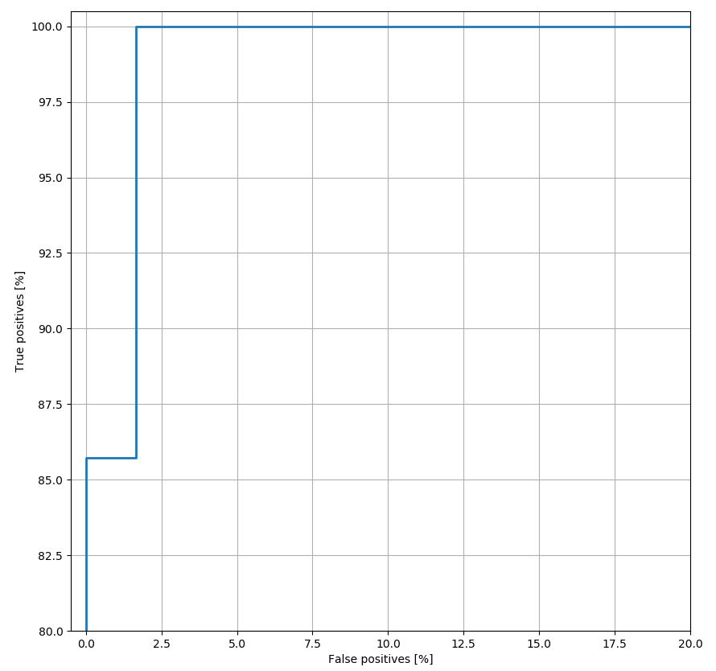

# COVID-19 Chest X-Ray Model

The goals of this project are threefold: (1) to explore development of a machine learning
algorithm to distinguish chest X-rays of individuals with respiratory
illness testing positive for COVID-19 from other X-rays, (2) to
promote discovery of patterns in such X-rays via machine learning
interpretability algorithms, and (3) to build more robust and extensible machine learning infrastructure trained on a variety of data types, to aid in the global response to COVID-19. 

We are calling on machine learning practitioners and healthcare
professionals who can contribute their expertise to this effort. If you
are interested in getting involved in this project by lending your
expertise, or sharing data through data-sharing agreements, please reach out to us ([contact info](#contact) is at the bottom
of this page); otherwise, feel free to experiment with the code base in
this repo. The initial model was built by Blake VanBerlo of the Municipal Artificial Intelligence Applications Lab at the City of London, Canada.

A model has been trained on a dataset composed of X-rays
labeled positive for COVID-19 infection, normal X-rays, and X-rays
depicting evidence of other pneumonias. Currently, we are using
[Local Interpretable
Model-Agnostic Explanations](https://arxiv.org/pdf/1602.04938.pdf) (i.e.
LIME) as the interpretability method being applied to the model. This
project is in need of more expertise and more data. This
project is in its infancy and not a tool for medical diagnosis. The immediacy of this work cannot be
overstated, as any insights derived from this project may be of benefit
to healthcare practitioners and researchers as the COVID-19 pandemic
continues to evolve.


## Why X-rays?
There have been promising efforts to apply machine learning to aid in
the diagnosis of COVID-19 based on
[CT scans](https://pubs.rsna.org/doi/10.1148/radiol.2020200905). Despite
the success of these methods, the fact remains that COVID-19 is an
infection that is likely to be experienced by communities of all sizes.
X-rays are inexpensive and quick to perform; therefore, they are more
accessible to healthcare providers working in smaller and/or remote
regions. Any insights that may be derived as a result of explainability
algorithms applied to a successful model will be invaluable to the
global effort of identifying and treating cases of COVID-19. This model is a prototype system and not for medical use and does not offer a diagnosis. 

## Getting Started
1. Clone this repository (for help see this
   [tutorial](https://help.github.com/en/github/creating-cloning-and-archiving-repositories/cloning-a-repository)).
2. Install the necessary dependencies (listed in
   [requirements.txt](requirements.txt)). To do this, open a terminal in
   the root directory of the project and run the following:
   ```
   $ pip install -r requirements.txt
   ```
3. Create a new folder to contain all of your raw data. Set the _RAW_DATA_
   field in the _PATHS_ section of [config.yml](config.yml) to the
   address of this new folder.
4. Clone the
   [covid-chestxray-dataset](https://github.com/ieee8023/covid-chestxray-dataset)
   repository inside of your _RAW_DATA_ folder. Set the _MILA_DATA_
   field in the _PATHS_ section of [config.yml](config.yml) to the
   address of the root directory of the cloned repository (for help see
   [Project Config](#project-config)).
5. Clone the
   [Figure1-COVID-chestxray-dataset](https://github.com/agchung/Figure1-COVID-chestxray-dataset)
   repository inside of your _RAW_DATA_ folder. Set the _FIGURE1_DATA_
   field in the _PATHS_ section of [config.yml](config.yml) to the
   address of the root directory of the cloned repository.
6. Download and unzip the
   [RSNA Pneumonia Detection Challenge](https://www.kaggle.com/c/rsna-pneumonia-detection-challenge)
   dataset from Kaggle somewhere on your local machine. Set the
   _RSNA_DATA_ field in the _PATHS_ section of
   [config.yml](config.yml) to the address of the folder containing the
   dataset.
7. Execute [_preprocess.py_](src/data/preprocess.py) to create Pandas
   DataFrames of filenames and labels. Preprocessed DataFrames and
   corresponding images of the dataset will be saved within
   _data/preprocessed/_.
8. Execute [_train.py_](src/train.py) to train the neural network model.
   The trained model weights will be saved within _results/models/_, and
   its filename will resemble the following structure:
   modelyyyymmdd-hhmmss.h5, where yyyymmdd-hhmmss is the current time.
   The [TensorBoard](https://www.tensorflow.org/tensorboard) log files
   will be saved within _results/logs/training/_.
9. In [config.yml](config.yml), set _MODEL_TO_LOAD_ within _PATHS_ to
   the path of the model weights file that was generated in step 6 (for
   help see [Project Config](#project-config)). Execute
   [_lime_explain.py_](src/interpretability/lime_explain.py) to generate
   interpretable explanations for the model's predictions on the test
   set. See more details in the [LIME Section](#lime).

## Train a model and visualize results
1. Once you have the appropriate datasets downloaded, execute
   [_preprocess.py_](src/data/preprocess.py). See
   [Getting Started](#getting-started) for help obtaining and organizing
   these raw image datasets. If this script ran properly, you should see
   folders entitled _train_, _test_, and _val_ within
   _data/preprocessed_. Addionally, you should see 3 files entitled
   _train_set.csv_, _val_set.csv_, and _test_set.csv_.
2. In [config.yml](config.yml), ensure that _EXPERIMENT_TYPE_ within
   _TRAIN_ is set to _'single_train'_.
3. Execute [train.py](src/train.py). The trained model's weights will be
   located in _results/models/_, and its filename will resemble the
   following structure: modelyyyymmdd-hhmmss.h5, where yyyymmdd-hhmmss
   is the current time. The model's logs will be located in
   _results/logs/training/_, and its directory name will be the current
   time in the same format. These logs contain information about the
   experiment, such as metrics throughout the training process on the
   training and validation sets, and performance on the test set. The
   logs can be visualized by running
   [TensorBoard](https://www.tensorflow.org/tensorboard) locally. See
   below for an example of a plot from a TensorBoard log file depicting
   loss on the training and validation sets versus epoch. Plots
   depicting the change in performance metrics throughout the training
   process (such as the example below) are available in the _SCALARS_
   tab of TensorBoard.  
     
   You can also visualize the trained model's performance on the test
   set. See below for an example of the ROC Curve and Confusion Matrix
   based on test set predictions. In our implementation, these plots are
   available in the _IMAGES_ tab of TensorBoard.  
   
   

## Binary vs. Multi-class Models
The documentation in this README assumes the user is training a binary
classifier, which is set by default in [config.yml](config.yml). The
user has the option of training a model to perform binary prediction on
whether the X-ray exhibits signs of COVID-19 or training a model to
perform multi-class classification to distinguish COVID-19 cases, other
pneumonia cases and normal X-rays. For a multi-class model, the output
layer is a vector of probabilities outputted by a softmax final layer.
In the multi-class scenario, precision, recall and F1-Score are
calculated for the COVID-19 class only. To train a multi-class
classifier, the user should be aware of the following changes that may
be made to [config.yml](config.yml):
- Within the _TRAIN_ section, set the _CLASS_MODE_ field to
  _'multiclass'_. By default, it is set to _'binary'_.
- The class names are listed in the _CLASSES_ field of the _DATA_
  section.
- The relative weight of classes can be modified by updating the
  _CLASS_MULTIPLIER_ field in the _TRAIN_ section.
- You can update hyperparameters for the multiclass classification model
  by setting the fields in the _DCNN_MULTICLASS_ subsection of _NN_.
- By default, LIME explanations are given for the class of the model's
  prediction. If you wish to generate LIME explanations for the COVID-19
  class only, set _COVID_ONLY_ within _LIME_ to _'true'_.

## Explanations
### LIME Explanations
Since the predictions made by this model may be used be healthcare
providers to benefit patients, it is imperative that the model's
predictions may be explained so as to ensure that the it is making
responsible predictions. Model explainability promotes transparency and
accountability of decision-making algorithms. Since this model is a
neural network, it is difficult to decipher which rules or heuristics it
is employing to make its predictions. Since so little is known about
presentation of COVID-19, interpretability is all the more important. We
used [Local Interpretable
Model-Agnostic Explanations](https://arxiv.org/pdf/1602.04938.pdf) (i.e.
LIME) to explain the predictions of the neural network classifier that
we trained. We used the implementation available in the authors' [GitHub
repository](https://github.com/marcotcr/lime). LIME perturbs the
features in an example and fits a linear model to approximate the neural
network at the local region in the feature space surrounding the
example. It then uses the linear model to determine which features were
most contributory to the model's prediction for that example. By
applying LIME to our trained model, we can conduct informed feature
engineering based on any obviously inconsequential features we see
insights from domain experts. For example, we noticed that different
characters present on normal X-rays were contributing to predictions
based off LIME explanations. To counter this unwanted behaviour, we have
taken steps to remove and inpaint textual regions as much as possible.
See the steps below to apply LIME to explain the model's predictions on
examples in the test set.
1. Having previously run _[preprocess.py](src/data/preprocess.py)_ and
   _[train.py](src/train.py)_, ensure that _data/processed/_ contains
   _Test_Set.csv_.
2. In [config.yml](config.yml), set _MODEL_TO_LOAD_ within _PATHS_ to
   the path of the model weights file (_.h5_ file) that you wish to use
   for prediction.
3. Execute _[lime_explain.py](src/interpretability/lime_explain.py)_. To
   generate explanations for different images in the test set, modify
   the following call: `explain_xray(lime_dict, i, save_exp=True)`. Set
   _i_ to the index of the test set image you would like to explain and
   rerun the script. If you are using an interactive console, you may
   choose to simply call the function again instead of rerunning the
   script.
4. Interpret the output of the LIME explainer. An image will have been
   generated that depicts the superpixels (i.e. image regions) that were
   most contributory to the model's prediction. Superpixels that
   contributed toward a prediction of COVID-19 are coloured green and
   superpixels that contributed against a prediction of COVID-19 are
   coloured red. The image will be automatically saved in
   _documents/generated_images/_, and its filename will resemble the
   following: _original-filename_exp_yyyymmdd-hhmmss.png_. See below for
   examples of this graphic.

It is our hope that healthcare professionals will be able to provide
feedback on the model based on their assessment of the quality of these
explanations. If the explanations make sense to individuals with
extensive experience interpreting X-rays, perhaps certain patterns can
be identified as radiological signatures of COVID-19.

Below are examples of LIME explanations. The top two images are
explanations of a couple of the binary classifier's predictions. Green
regions and red regions identify superpixels that most contributed to
and against prediction of COVID-19 respectively. The bottom two images
are explanations of a couple of the multi-class classifier's
predictions. Green regions and red regions identify superpixels that
most contributed to and against the predicted class respectively.

  
  
  


### Grad-CAM Explanations
We investigated Grad-CAM as an additional method of explainability.
Grad-CAM enables one to visualize the gradient of the label in the final
convolutional layer to produce a heatmap depicting regions of the image
that were highly important during prediction. The steps to use Grad-CAM
in this repository are as follows:
1. Follow steps 1 and 2 in [LIME Explanations](#lime-explanations).
2. Execute _[gradcam.py](src/interpretability/gradcam.py)_. To generate
   explanations for different images in the test set, modify the
   following call: `apply_gradcam(lime_dict, i, hm_intensity=0.5,
   save_exp=True)`. Set _i_ to the index of the test set image you would
   like to explain and rerun the script.
3. Interpret the output of Grad-CAM. Bluer pixels and redder pixels
   correspond to higher and lower values of the gradient at the final
   convolutional layer respectively. An image of your heatmap will be
   saved in _documents/generated_images/_, and its filename will
   resemble the following:
   _original-filename_gradcamp_yyyymmdd-hhmmss.png_. See below for
   examples of this graphic.

  


## Train multiple models and save the best one
Not every model trained will perform at the same level on the test set.
This procedure enables you to train multiple models and save the one
that scored the best result on the test set for a particular metric that
you care about optimizing.
1. Follow step 1 in
   [Train a model and visualize results](#train-a-model-and-visualize-results).
2. In [config.yml](config.yml), set _EXPERIMENT_TYPE_ within _TRAIN_ to
   _'multi_train'_.
3. Decide which metrics you would like to optimize and in what order. In
   [config.yml](config.yml), set _METRIC_PREFERENCE_ within _TRAIN_ to
   your chosen metrics, in order from most to least important. For
   example, if you decide to select the model with the best AUC on the
   test set, set the first element in this field to _'AUC'_.
4. Decide how many models you wish to train. In
   [config.yml](config.yml), set _NUM_RUNS_ within _TRAIN_ to your
   chosen number of training sessions. For example, if you wish to train
   10 models, set this field to _10_.
5. Execute [train.py](src/train.py). The weights of the model that had
   the best performance on the test set for the metric you specified
   will be located in _results/models/training/_, and its filename will
   resemble the following structure: modelyyyymmdd-hhmmss.h5, where
   yyyymmdd-hhmmss is the current time. Logs for each run will be
   located in _results/logs/training/_, and their names will be the
   current time in the same format. The log directory that has the same
   name as the model weights file corresponds to the run with the best
   metrics.

## Random Hyperparameter Search
Hyperparameter tuning is an important part of the standard machine
learning workflow. Our implementation allows users to conduct a random
hyperparameter search. Many fields in the _TRAIN_ and _NN_ sections of
[config.yml](config.yml) are considered to be hyperparameters. With the help of the
[HParam
Dashboard](https://www.tensorflow.org/tensorboard/hyperparameter_tuning_with_hparams),
one can see the effect of different combinations of hyperparameters on
the model's test set performance metrics.

In our random hyperparameter search, we study the effects of _x_ random
combinations of hyperparameters by training the model _y_ times for each
of the _x_ combinations and recording the results. See the steps below
on how to conduct a random hyperparameter search with our implementation
for the following 4 hyperparameters: _dropout_, _learning rate_, _conv
blocks_, and _optimizer_.
1. In the in the _HP_SEARCH_ section of [config.yml](config.yml), set
   the number of random combinations of hyperparameters you wish to
   study and the number of times you would like to train the model for
   each combination.
   ```
   COMBINATIONS: 50
   REPEATS: 2
   ```
2. Set the ranges of hyperparameters you wish to study in the _RANGES_
   subsection of the _HP_SEARCH_ section of [config.yml](config.yml).
   Consider whether your hyperparameter ranges are continuous (i.e.
   real), discrete or integer ranges and whether any need to be
   investigated on the logarithmic scale.
   ```
   DROPOUT: [0.2, 0.5]          # Real range
   LR: [-4.0, -2.5]             # Real range on logarithmic scale (10^x)   
   CONV_BLOCKS: [2, 4]          # Integer range
   OPTIMIZER: ['adam', 'sgd']   # Discrete range
   ```
3.  Within the _random_hparam_search()_ function defined in
    [train.py](src/train.py), add your hyperparameters as HParam objects
    to the list of hyperparameters being considered (if they are not
    already there).
    ```
    HPARAMS.append(hp.HParam('DROPOUT', hp.RealInterval(hp_ranges['DROPOUT'][0], hp_ranges['DROPOUT'][1])))
    HPARAMS.append(hp.HParam('LR', hp.RealInterval(hp_ranges['LR'][0], hp_ranges['LR'][1])))
    HPARAMS.append(hp.HParam('CONV_BLOCKS', hp.IntInterval(hp_ranges['CONV_BLOCKS'][0], hp_ranges['CONV_BLOCKS'][1])))
    HPARAMS.append(hp.HParam('OPTIMIZER', hp.Discrete(hp_ranges['OPTIMIZER'])))
    ```
4. In the appropriate location (varies by hyperparameter), ensure that
   you assign the hyperparameters based on the random combination. If
   the hyperparameter already exists in the _NN_ section of
   [config.yml](config.yml), this will be done for you automatically. In
   our example, all of these hyperparameters are already in the _NN_
   section of the project config, so it will be done automatically. If the hyperparameter is not in the _NN_ section, assign the
   hyperparameter value within the code for a single training run in the
   _random_hparam_search()_ method in [train.py](src/train.py) (for
   example, batch size).
   ```
   cfg['TRAIN']['BATCH_SIZE'] = hparams['BATCH_SIZE']
   ```
5. In [config.yml](config.yml), set _EXPERIMENT_TYPE_ within the _TRAIN_
   section to _'hparam_search'_.
6. Execute [train.py](src/train.py). The experiment's logs will be
   located in _results/logs/hparam_search/_, and the directory name will
   be the current time in the following format: _yyyymmdd-hhmmss_. These
   logs contain information on test set metrics with models trained on
   different combinations of hyperparameters. The logs can be visualized
   by running [TensorBoard](https://www.tensorflow.org/tensorboard)
   locally and clicking on the _HPARAM_ tab.

## Batch predictions and explanations
Once a trained model is produced, the user may wish to obtain
predictions and explanations for a list of images. The steps below
detail how to run prediction for all images in a specified folder, given
a trained model and serialized
[LIME Image Explainer object](https://lime-ml.readthedocs.io/en/latest/lime.html#lime.lime_image.LimeImageExplainer).
1. Ensure that you have already run
   _[lime_explain.py](src/interpretability/lime_explain.py)_ after
   training your model, as it will have generated and saved a
   LIME Image Explainer object at _data/interpretability/lime_explainer.pkl_.
2. Specify the path of the image folder containing the X-ray images you
   wish to predict and explain. In [config.yml](config.yml), set
   _BATCH_PRED_IMGS_ within _PATHS_ to the path of your image folder.
3. In [config.yml](config.yml), set _MODEL_TO_LOAD_ within _PATHS_ to
   the path of the model weights file (_.h5_ file) that you wish to use
   for prediction.
4. Execute _[predict.py](src/predict.py)_. Running this script will
   preprocess images, run prediction for all images, and run LIME to
   explain the predictions. Prediction results will be saved in a .csv
   file, which will be located in _results/predictions/yyyymmdd-hhmmss_
   (where yyyymmdd-hhmmss is the time at which the script was executed),
   and will be called _predictions.csv_. The .csv file will contain
   image file names, predicted class, model output probabilities, and
   the file name of the corresponding explanation. The images depicting
   LIME explanations will be saved in the same folder.

## Azure Machine Learning Pipelines
We ran several of our training experiments on Azure cloud compute
instances. To do this, we created Jupyter notebooks to define and run
experiments in Azure, and Python scripts corresponding to pipeline
steps. We included these files in the _azure/_ folder, in case they may
benefit any parties hoping to extend our project. Note that Azure is
**not** required to run this project - all Python files necessary to get
started are in the _src/_ folder. If you plan on using the Azure machine
learning pipelines defined in the _azure/_ folder, be sure to install
the _azureml-sdk_ and _azureml_widgets_ packages.

## Project Structure
The project looks similar to the directory structure below. Disregard
any _.gitkeep_ files, as their only purpose is to force Git to track
empty directories. Disregard any _.\__init\__.py_ files, as they are
empty files that enable Python to recognize certain directories as
packages.

```
├── azure                         <- folder containing Azure ML pipelines
├── data
│   ├── interpretability          <- Interpretability files
│   └── processed                 <- Products of preprocessing
|
├── documents
|   ├── generated_images          <- Visualizations of model performance, experiments
|   └── readme_images             <- Image assets for README.md
├── results
│   ├── logs                      <- TensorBoard logs
│   └── models                    <- Trained model weights
|
├── src
│   ├── custom                    <- Custom TensorFlow components
|   |   └── metrics.py            <- Definition of custom TensorFlow metrics
│   ├── data                      <- Data processing
|   |   └── preprocess.py         <- Main preprocessing script
│   ├── interpretability          <- Model interpretability scripts
|   |   ├── gradcam.py            <- Script for generating Grad-CAM explanations
|   |   └── lime_explain.py       <- Script for generating LIME explanations
│   ├── models                    <- TensorFlow model definitions
|   |   └── models.py             <- Script containing model definition
|   ├── visualization             <- Visualization scripts
|   |   └── visualize.py          <- Script for visualizing model performance metrics
|   ├── predict.py                <- Script for running batch predictions
|   └── train.py                  <- Script for training model on preprocessed data
|
├── .gitignore                    <- Files to be be ignored by git.
├── config.yml                    <- Values of several constants used throughout project
├── LICENSE                       <- Project license
├── README.md                     <- Project description
└── requirements.txt              <- Lists all dependencies and their respective versions
```

## Project Config
Many of the components of this project are ready for use on your X-ray
datasets. However, this project contains several configurable variables that
are defined in the project config file: [config.yml](config.yml). When
loaded into Python scripts, the contents of this file become a
dictionary through which the developer can easily access its members.

For user convenience, the config file is organized into major steps in
our model development pipeline. Many fields need not be modified by the
typical user, but others may be modified to suit the user's specific
goals. A summary of the major configurable elements in this file is
below.

#### PATHS
- **RAW_DATA**: Path to parent folder containing all downloaded datasets (i.e. _MILA_DATA_, _FIGURE1_DATA_, _RSNA_DATA_)
- **MILA_DATA**: Path to folder containing
  [Mila COVID-19 image dataset](https://github.com/ieee8023/covid-chestxray-dataset)
- **FIGURE1_DATA**: Path to folder containing
  [Figure 1 image dataset](https://github.com/agchung/Figure1-COVID-chestxray-dataset)
- **RSNA_DATA**: Path to folder containing
  [RSNA Pneumonia Detection Challenge dataset](https://www.kaggle.com/c/rsna-pneumonia-detection-challenge)
- **MODEL_WEIGHTS**: Path at which to save trained model's weights
- **MODEL_TO_LOAD**: Path to the trained model's weights that you would
  like to load for prediction
- **BATCH_PRED_IMGS**: Path to folder containing images for batch
  prediction
- **BATCH_PREDS**: Path to folder for outputting batch predictions and
  explanations
#### DATA
- **IMG_DIM**: Desired target size of image after preprocessing
- **VIEWS**: List of types of chest X-ray views to include. By default,
  posteroanterior and anteroposterior views are included.
- **VAL_SPLIT**: Fraction of the data allocated to the validation set
- **TEST_SPLIT**: Fraction of the data allocated to the test set
- **NUM_RSNA_IMGS**: Number of images from the RSNA dataset that you wish
  to include in your assembled dataset
- **CLASSES**: This is an ordered list of class names. Must be the same
  length as the number of classes you wish to distinguish.
#### TRAIN
- **CLASS_MODE**: The type of classification to be performed. Should be
  set before performing preprocessing. Set to either _'binary'_ or
  _'multiclass'_.
- **CLASS_MULTIPLIER**: A list of coefficients to multiply the computed
  class weights by during computation of loss function. Must be the same
  length as the number of classes.
- **EXPERIMENT_TYPE**: The type of training experiment you would like to
  perform if executing [_train.py_](src/train.py). For now, the only
  choice is _'single_train'_.
- **BATCH_SIZE**: Mini-batch size during training
- **EPOCHS**: Number of epochs to train the model for
- **THRESHOLDS**: A single float or list of floats in range [0, 1]
  defining the classification threshold. Affects precision and recall
  metrics.
- **PATIENCE**: Number of epochs to wait before freezing the model if
  validation loss does not decrease.
- **IMB_STRATEGY**: Class imbalancing strategy to employ. In our
  dataset, the ratio of positive to negative ground truth was very low,
  prompting the use of these strategies. Set either to _'class_weight'_
  or _'random_oversample'_.
- **METRIC_PREFERENCE**: A list of metrics in order of importance (from
  left to right) to guide selection of the best model during a
  _'multi_train'_ experiment
- **NUM_RUNS**: The number of times to train a model in the
  _'multi_train'_ experiment
- **NUM_GPUS**: The number of GPUs to distribute training over

#### NN
- **DCNN_BINARY**: Contains definitions of configurable hyperparameters
  associated with a custom deep convolutional neural network for binary
  classification. The values currently in this section were the optimal
  values for our dataset informed by heuristically selecting
  hyperparameters.
  - **KERNEL_SIZE**: Kernel size for convolutional layers
  - **STRIDES**: Size of strides for convolutional layers
  - **INIT_FILTERS**: Number of filters for first convolutional layer
  - **FILTER_EXP_BASE**: Base of exponent that determines number of
    filters in successive convolutional layers. For layer _i_, _#
    filters = INIT_FILTERS * (FILTER_EXP_BASE) <sup>i</sup>_
  - **CONV_BLOCKS**: The number of convolutional blocks. Each block
    contains a 2D convolutional layer, a batch normalization layer,
    activation layer, and a maxpool layer.
  - **NODES_DENSE0**: The number of nodes in the fully connected layer
    following flattening of parameters
  - **LR**: Learning rate
  - **OPTIMIZER**: Optimization algorithm
  - **DROPOUT**: Dropout rate
  - **L2_LAMBDA**: L2 regularization parameter
- **DCNN_MULTICLASS**: Contains definitions of configurable
  hyperparameters associated with a custom deep convolutional neural
  network for multi-class classification. The fields are identical to
  those in the _DCNN_BINARY_ subsection.
#### LIME
- **KERNEL_WIDTH**: Affects size of neighbourhood around which LIME
  samples for a particular example. In our experience, setting this
  within the continuous range of _[1.5, 2.0]_ is large enough to produce
  stable explanations, but small enough to avoid producing explanations
  that approach a global surrogate model.
- **FEATURE_SELECTION**: The strategy to select features for LIME
  explanations. Read the LIME creators'
  [documentation](https://lime-ml.readthedocs.io/en/latest/lime.html)
  for more information.
- **NUM_FEATURES**: The number of features to
  include in a LIME explanation
- **NUM_SAMPLES**: The number of samples used to fit a linear model when
  explaining a prediction using LIME **COVID_ONLY**: Set to _'true'_ if
  you want explanations to be provided for the predicted logit
  corresponding to the "COVID-19" class, despite the model's prediction.
  If set to _'false'_, explanations will be provided for the logit
  corresponding to the predicted class.
#### HP_SEARCH
- **METRICS**: List of metrics on validation set to monitor in
  hyperparameter search. Can be any combination of _{'accuracy', 'loss',
  'recall', 'precision', 'auc'}_
- **COMBINATIONS**: Number of random combinations of hyperparameters to
  try in hyperparameter search
- **REPEATS**: Number of times to repeat training per combination of
  hyperparameters
- **RANGES**: Ranges defining possible values that hyperparameters may
  take. Be sure to check [_train.py_](src/train.py) to ensure that your
  ranges are defined correctly as real or discrete intervals (see
  [Random Hyperparameter Search](#random-hyperparameter-search) for an
  example).

#### PREDICTION
- **THRESHOLD**: Classification threshold for prediction

## Contact
**Matt Ross**  
Manager, Artificial Intelligence  
Information Technology Services 
City Manager’s Office 
The Corporation of the City of London  
201 Queens Ave. Suite 300, London, ON. N6A 1J1  

**Blake VanBerlo**  
Data Scientist  
City of London Municipal Artificial Intelligence Applications Lab  
C: blake@vanberloconsulting.com
